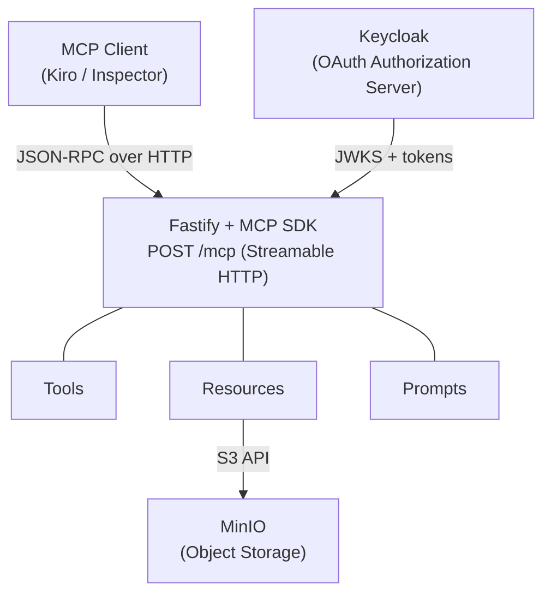

# MCP Server Workshop

> **Note:** This project is for **educational/demo purposes only** and is not production-ready. It is designed to accompany a live-coding workshop and intentionally prioritizes clarity over hardening.

Build a **remote MCP server** from scratch using Fastify, Keycloak OAuth, and MinIO storage.

This repository accompanies a 90-minute live-coding workshop that walks through the [Model Context Protocol](https://modelcontextprotocol.io) step by step — from an empty Fastify endpoint to a fully authenticated server with tools, resources, and prompts.

## Workshop Steps (Branch Index)

Each step lives on its own branch so you can check out any point in the progression:

| Branch | Topic | Description |
|--------|-------|-------------|
| `step-0-boilerplate` | Setup | Fastify server, config, Turbo scripts, empty `/mcp` endpoint |
| `step-1-primitives` | MCP Primitives | Tool `random-number`, resource (local + MinIO), prompt `workshop-demo` |
| `step-2-auth-discovery` | Auth Discovery | Protected Resource Metadata (RFC 9728), `401 WWW-Authenticate`, middleware skeleton |
| `step-3-jwt-middleware` | JWT Validation | JWKS fetch with `jose`, JWT verification, `AuthInfo`, authenticated tool `greet` |
| `main` | Complete | Full working server with all features integrated |

```bash
# Switch to a specific step
git checkout step-0-boilerplate
```

## Stack

- **Runtime:** Node.js 24, TypeScript
- **HTTP Server:** Fastify 5
- **MCP SDK:** `@modelcontextprotocol/server` + `/node` + `/fastify` (v2 alpha)
- **Auth:** OAuth 2.1 Resource Server — JWT verification via `jose` + JWKS
- **Authorization Server:** Keycloak (Docker)
- **Object Storage:** MinIO (Docker)
- **Schema Validation:** Zod 4
- **Dev Tooling:** Turbo, tsx, MCP Inspector

## Architecture



### Pre-configured realm

The Docker Compose setup imports `keycloak/realm-export.json` on first start, which includes:

- Realm: `mcpworkshop`
- Client: `mcp-client` (public, PKCE-enabled)
- Test user credentials available in the Keycloak admin console (http://localhost:8080, admin/admin)

## Prerequisites

- Node.js >= 24 (see `.nvmrc`)
- [pnpm](https://pnpm.io) 11+
- Docker & Docker Compose

## Getting Started

```bash
# Install dependencies
pnpm install

# Start everything (server + Keycloak + MinIO + MCP Inspector)
pnpm dev
```

This uses Turbo to run in parallel:

| Service | URL |
|---------|-----|
| MCP Server | http://localhost:3000/mcp |
| Health Check | http://localhost:3000/health |
| Keycloak Admin Console | http://localhost:8080 (admin/admin) |
| MinIO Console | http://localhost:9001 (minioadmin/minioadmin) |
| MCP Inspector | http://localhost:6274 |

## Key Endpoints

| Endpoint | Method | Description |
|----------|--------|-------------|
| `/mcp` | POST | MCP JSON-RPC endpoint (Streamable HTTP transport) |
| `/health` | GET | Health check |
| `/.well-known/oauth-protected-resource/mcp` | GET | Protected Resource Metadata (RFC 9728) |
| `/.well-known/oauth-protected-resource` | GET | Root fallback for resource metadata |

## MCP Primitives

### Tools

| Name | Description | Auth Required |
|------|-------------|:---:|
| `random-number` | Generates a random number between min and max | No |
| `greet` | Personalized greeting using the authenticated user's name from JWT | Yes |

### Resources

| Name | URI | Source |
|------|-----|--------|
| `local-guide` | `local://local-guide` | Local filesystem (`resources/local-guide.md`) |
| `minio-guide` | `minio://minio-guide` | MinIO object storage (`docs/minio-guide.md`) |

### Prompts

| Name | Description |
|------|-------------|
| `workshop-demo` | Orchestrates `greet` + `random-number` to welcome the authenticated user with a lucky number |

## Design Decisions

- **Stateless** — a new `McpServer` + transport instance is created per request and destroyed on close (`sessionIdGenerator: undefined`)
- **Streamable HTTP** — single POST endpoint, no SSE sessions, compatible with any proxy/CDN/serverless
- **OAuth 2.1 Resource Server** — the server validates JWTs with JWKS; it does not authenticate users directly
- **Factory pattern** — `createMcpServer()` ensures complete isolation between concurrent requests

## Project Structure

```
src/
├── server.ts                  # Fastify setup, well-known endpoints, lifecycle
├── routes/
│   └── mcp.ts                 # POST /mcp route with per-request MCP server
├── components/
│   └── createMcpServer.ts     # Factory: registers tools, resources, prompts
├── middleware/
│   └── auth.ts                # JWT/JWKS verification, AuthInfo injection
└── utils/
    ├── config.ts              # Ports, URLs, Keycloak/MinIO config
    └── types.ts               # Type guards and utilities
```

## Scripts

| Script | Description |
|--------|-------------|
| `pnpm dev` | Start all services in parallel (Turbo) |
| `pnpm dev:server` | Start only the Fastify server (hot-reload) |
| `pnpm dev:docker` | Start only Docker services (Keycloak + MinIO) |
| `pnpm dev:inspector` | Start only the MCP Inspector |
| `pnpm build` | Compile TypeScript |
| `pnpm start` | Run compiled output |
| `pnpm lint` | ESLint |

## MCP Spec References

- Implementation: [2025-11-25 (latest stable)](https://modelcontextprotocol.io/specification/2025-11-25)
- Upcoming: [2026-07-28 (release candidate)](https://modelcontextprotocol.io/specification/draft)
- Transport: Streamable HTTP
- Auth: OAuth 2.1, PKCE (S256), Protected Resource Metadata (RFC 9728)

## Keycloak: the Authorization Server

The MCP spec mandates OAuth 2.1 for authentication. In this architecture the MCP server is a **Resource Server** — it validates tokens but never authenticates users directly. That job belongs to an external Authorization Server.

We use **Keycloak** (self-hosted, Docker) to fill that role:

- **Token issuance** — Keycloak handles the Authorization Code + PKCE flow and emits JWTs.
- **JWKS endpoint** — The MCP server fetches Keycloak's public keys at startup and verifies token signatures locally, with zero per-request network calls.
- **User management** — A pre-configured realm (`mcpworkshop`) ships with a test user so the workshop works out of the box.
- **CIMD support** — Keycloak is started with `--features=cimd`, enabling Client ID Metadata Document verification for advanced client registration scenarios.
- **Discovery** — Keycloak exposes `.well-known/openid-configuration` (RFC 8414), which the MCP client uses to locate the authorization and token endpoints automatically.
