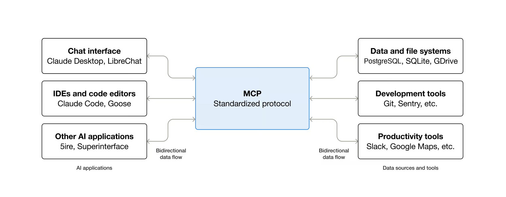
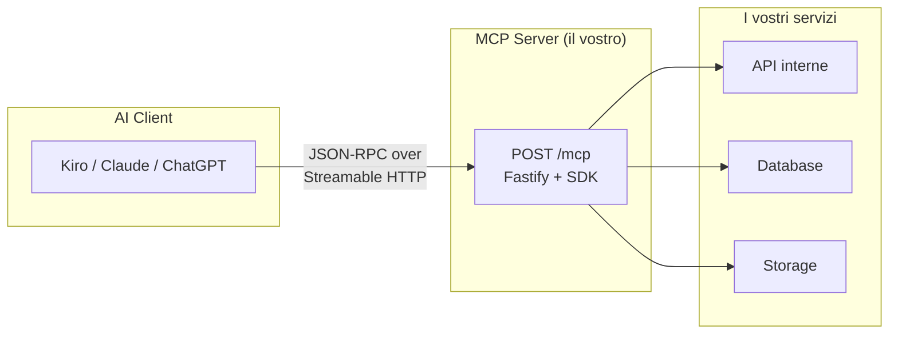
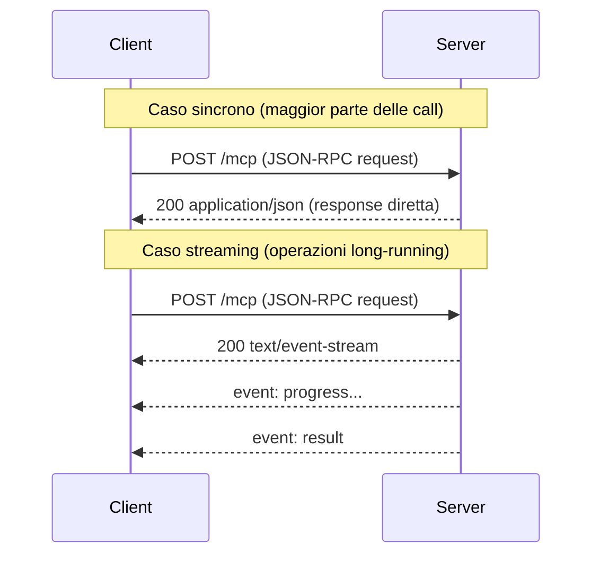
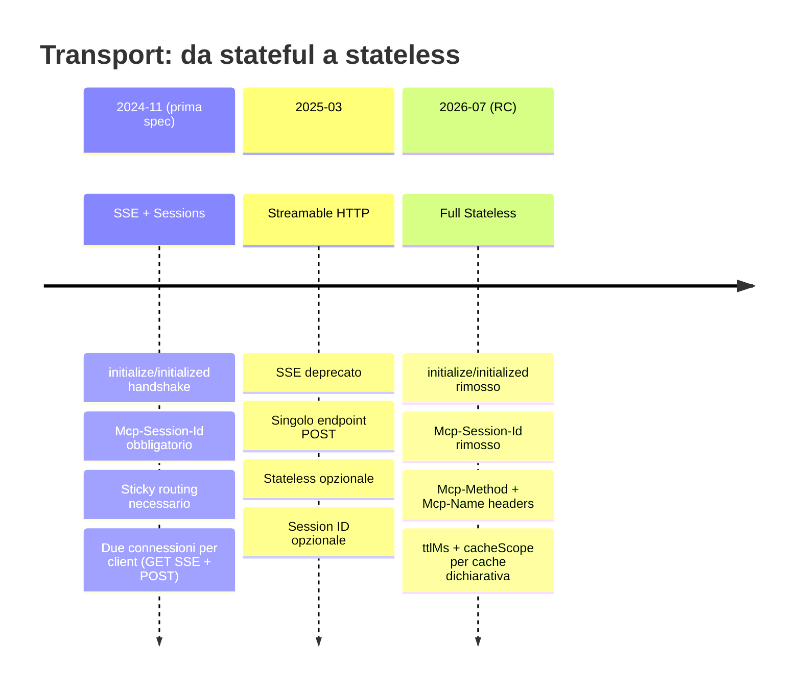
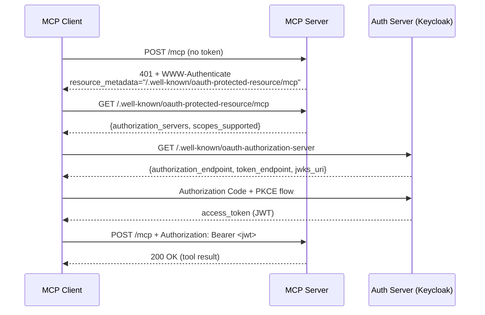
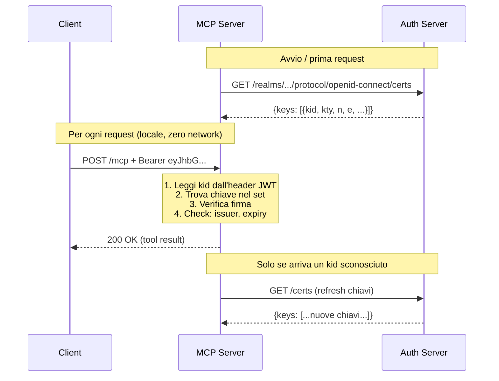
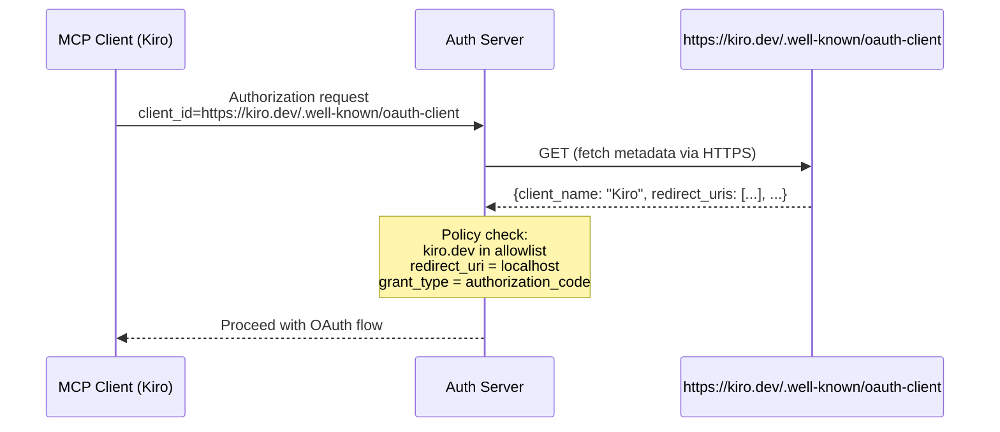

# MCP Server: from Scratch to Production



---

## Why MCP

MCP è lo standard de facto per connettere AI client a servizi esterni.
Figma, Notion, GitHub, AWS: tutti espongono MCP server.

- MCP non è una libreria, è un **protocollo** (come HTTP, come gRPC)
- È l'interfaccia tra il reasoning del modello AI e le azioni nel mondo reale
- Il modello decide *cosa* fare (reasoning), MCP gli dice *come* farlo (protocol)
- Se il vostro servizio non espone un endpoint MCP, per un AI agent non esiste

---

## What is an MCP Server

Un MCP server è un processo che espone **capability** in un formato che un AI client può scoprire e utilizzare autonomamente.

Il modello si connette, chiede "cosa sai fare?", riceve la lista di tool con description e schema dei parametri, e decide autonomamente quando e come invocarli.

| API REST | MCP Server |
|----------|------------|
| La usa uno **sviluppatore** che legge la doc e scrive codice | Lo usa un **modello AI** che legge le description e decide a runtime |



---

## Stack del Workshop

- **SDK ufficiale TypeScript** (`@modelcontextprotocol/sdk`), non un framework opinionated
- **Fastify** come web server: il vostro backend esistente, esteso con `/mcp`
- **jose** per JWT/JWKS, **Zod** per schema validation
- **Keycloak** come Authorization Server (OIDC)
- **MinIO** come object storage S3-compatible (per le resource)
- **Node.js 24**, TypeScript

L'SDK ci dà due cose: registrazione delle primitive (tool, resource, prompt) e trasporto JSON-RPC su Streamable HTTP.

---

## JSON-RPC 2.0

Il formato dei messaggi tra client e server è JSON-RPC 2.0: request/response minimale e standardizzato.

```json
// Client → Server
{"jsonrpc": "2.0", "id": 1, "method": "tools/call",
 "params": {"name": "add", "arguments": {"a": 2, "b": 3}}}

// Server → Client
{"jsonrpc": "2.0", "id": 1,
 "result": {"content": [{"type": "text", "text": "5"}]}}
```

Input validation via JSON Schema.

---

## Transport: Streamable HTTP

Il transport definisce come i messaggi JSON-RPC vengono incapsulati e consegnati. La spec definisce due transport standard:

**stdio**: per server locali (sottoprocesso, stdin/stdout)

**Streamable HTTP**: per server remoti (quello che implementiamo)



Caratteristiche: singolo endpoint, stateless by design, infrastruttura HTTP standard, streaming opzionale.

---

## Streamable HTTP vs HTTP+SSE (deprecato)

| Aspetto | HTTP+SSE (vecchio) | Streamable HTTP |
|---------|-------------------|-----------------|
| Connessioni per client | 2 (GET SSE + POST) | 1 (POST) |
| Sticky sessions | Obbligatorie | Non necessarie |
| Serverless / autoscaling | Incompatibile | Nativo |
| Caching HTTP | Impossibile | Standard |
| Deploy blue-green | Problematico | Trasparente |
| Debugging | Stream continuo | Coppie request/response |

---

## Stateful → Stateless: Evolution



Lo stato applicativo (se serve) si gestisce con handle espliciti ritornati dai tool, non nel protocollo di trasporto.

---

## Il Pattern: Server per Request

```typescript
// Per ogni POST a /mcp:
const mcpServer = createMcpServer()           // 1. nuova istanza
const transport = new NodeStreamableHTTPServerTransport({
  sessionIdGenerator: undefined,              // 2. nessun session ID
})
await mcpServer.connect(transport)            // 3. connetti

reply.raw.on("close", () => {
  void Promise.all([transport.close(), mcpServer.close()])
})

await transport.handleRequest(request.raw, reply.raw, request.body)
```

- **Factory `createMcpServer()`**: isolamento totale tra request concorrenti
- **`sessionIdGenerator: undefined`**: opt-in esplicito per stateless, nessun sticky routing

---

## Le Tre Primitive MCP

| Primitiva | Analogia | Chi la invoca | Side effects? |
|-----------|----------|---------------|---------------|
| **Tool** | Una funzione che fa qualcosa | Il modello AI (function calling) | Sì |
| **Resource** | Un documento da leggere | Il client (per contesto) | No |
| **Prompt** | Un template di conversazione | L'utente/client | No |

---

## Tool: `random-number`

I tool sono azioni che il modello decide di eseguire durante il reasoning. La `description` è il contratto tra voi e il modello.

```typescript
server.registerTool(
  "random-number",
  {
    title: "Random Number",
    description: "Generates a random number between min and max (inclusive).",
    inputSchema: z.object({
      min: z.number().default(1).describe("Minimum value (inclusive)"),
      max: z.number().default(100).describe("Maximum value (inclusive)"),
    }),
  },
  async ({ min, max }) => {
    const value = Math.floor(Math.random() * (max - min + 1)) + min
    return {
      content: [{ type: "text" as const, text: String(value) }],
    }
  },
)
```

---

## Resource: contesto read-only

Le resource sono dati che il client fetcha per arricchire il contesto del modello. Nessun side effect, pure letture.

```typescript
server.registerResource(
  "local-guide",
  "local://local-guide",
  {
    title: "Local Guide",
    description: "Workshop documentation read from local filesystem",
    mimeType: "text/markdown",
  },
  async uri => {
    const filePath = resolve(process.cwd(), "resources", "local-guide.md")
    const text = await readFile(filePath, "utf-8")
    return { contents: [{ uri: uri.href, text }] }
  },
)
```

Use case: documentazione interna, schema del database, configurazione corrente, file di un repository.

---

## Prompt: template di conversazione

I prompt sono template predefiniti offerti al client. Un **tool** lo chiama il modello; un **prompt** lo attiva l'utente.

```typescript
server.registerPrompt(
  "workshop-demo",
  {
    title: "Workshop Demo",
    description: "Greets the user and generates a lucky number.",
    argsSchema: z.object({
      language: z.enum(["en", "it", "es", "fr"]).default("it"),
      maxNumber: z.number().default(100),
    }),
  },
  ({ language, maxNumber }, { http }) => {
    const name = http?.authInfo?.extra?.name || "partecipante"
    return {
      messages: [{
        role: "user",
        content: { type: "text", text: `Saluta ${name} in ${language}, poi genera un lucky number (max ${maxNumber}).` },
      }],
    }
  },
)
```

---

## Auth in MCP: la storia

**Prima della spec 2025-03-26:** nessuno standard. API key, basic auth, oppure niente. Zero interoperabilità tra client.

**Dalla spec 2025-11-25:** OAuth 2.1 formalizzato. L'MCP server è un **Resource Server**: verifica token, non autentica. L'autenticazione la fa un Authorization Server separato.

Il flow è standardizzato, automatizzabile, revocabile.

---

## Discovery Flow (RFC 9728)



Il server dichiara Protected Resource Metadata (RFC 9728). Il client scopre dove autenticarsi senza configurazione manuale.

---

## Protected Resource Metadata

```typescript
// Well-known endpoints (RFC 9728 §3.1)
app.get("/.well-known/oauth-protected-resource/mcp",
  async () => protectedResourceMetadata)

// Il metadata
export const protectedResourceMetadata = {
  resource: `${config.baseUrl}/mcp`,
  authorization_servers: [
    `${config.keycloak.baseUrl}/realms/${config.keycloak.realm}`,
  ],
  scopes_supported: ["openid", "profile", "email"],
  bearer_methods_supported: ["header"],
} as const
```

La 401 include l'header `WWW-Authenticate: Bearer resource_metadata="<url>"` che punta al metadata.

---

## JWT + JWKS: verifica del token

I JWT sono firmati dall'Authorization Server con una chiave privata. Il nostro server verifica con la chiave pubblica corrispondente. Verifica locale, zero network per request.



---

## Middleware: validazione con jose

```typescript
import { createRemoteJWKSet, jwtVerify } from "jose"

const jwkSet = createRemoteJWKSet(
  new URL(keycloakUrls.jwks),
  { cacheMaxAge: 60_000 },
)

// Nel hook onRequest:
const { payload } = await jwtVerify(accessToken, jwkSet, {
  issuer: keycloakUrls.issuer,
})

request.raw.auth = {
  token: accessToken,
  clientId: payload.azp,
  scopes: payload.scope?.split(" ").filter(Boolean) ?? [],
  expiresAt: payload.exp,
  extra: {
    sub: payload.sub,
    email: payload.email,
    preferred_username: payload.preferred_username,
    name: payload.name,
  },
} satisfies AuthInfo
```

---

## Tool autenticato: `greet`

Il tool non chiede "chi sei?" come parametro. Lo sa dal token.

```typescript
server.registerTool(
  "greet",
  {
    title: "Greet User",
    description: "Returns a personalized greeting for the authenticated user.",
    inputSchema: z.object({
      language: z.enum(["en", "it", "es", "fr"]).default("en"),
    }),
  },
  async ({ language }, { http }) => {
    const name = http?.authInfo?.extra?.name || "stranger"
    const greetings: Record<string, string> = {
      en: `Hello, ${name}! Welcome to the MCP Workshop.`,
      it: `Ciao, ${name}! Benvenuto al MCP Workshop.`,
      es: `Hola, ${name}! Bienvenido al MCP Workshop.`,
      fr: `Bonjour, ${name}! Bienvenue au MCP Workshop.`,
    }
    return { content: [{ type: "text", text: greetings[language] }] }
  },
)
```

Stesso meccanismo di Notion quando chiede "mostrami le mie pagine": il server estrae l'identità dal JWT.

---

## Client Registration: il problema

Come fa l'Authorization Server a sapere chi è il client che chiede un token?

| Approccio | Limiti |
|-----------|--------|
| **Pre-registered ID** | Non scala a N client, consent generico, niente revoca granulare |
| **DCR (RFC 7591)** | DoS, nomi self-declared, UUID illeggibili nel consent, supporto scarso |
| **CIMD** | Identità verificabile via dominio, zero registrazione, policy granulari |

---

## CIMD: Client ID Metadata Documents

Il `client_id` è un URL: `https://kiro.dev/.well-known/oauth-client`



Domain ownership = identità del client. Il certificato TLS lo garantisce.

---

## CIMD vs alternative: confronto

| Problema | Shared ID + PKCE | DCR | CIMD |
|---|---|---|---|
| Consent leggibile | Nome generico | UUID | Nome + dominio verificato |
| Revoca granulare | Tutto o niente | Per client | Per client |
| Policy per client | Tutti uguali | Nessuna pre-reg | Policy su dominio |
| DoS/pollution | N/A | Registrazione aperta | Nessun endpoint |
| Identità verificabile | No | Self-declared | TLS + dominio |
| Supporto AS | Tutti | Pochi | In crescita |

---

## Spec 2026-07-28: dove va MCP

La prossima spec (RC disponibile, final a luglio 2026) conferma la direzione stateless:

- **`initialize`/`initialized` rimosso**: niente handshake, la prima request è direttamente un `tools/call`
- **`Mcp-Session-Id` rimosso**: zero sessioni a livello di protocollo
- **`Mcp-Method` + `Mcp-Name` headers**: routing senza deep packet inspection
- **`ttlMs` + `cacheScope`**: cache dichiarativa sulle list response
- **Extensions framework**: Tasks (long-running), MCP Apps (UI in iframe), opt-in
- **Roots, Sampling, Logging deprecati**: sostituiti da tool params, LLM API dirette, OpenTelemetry
